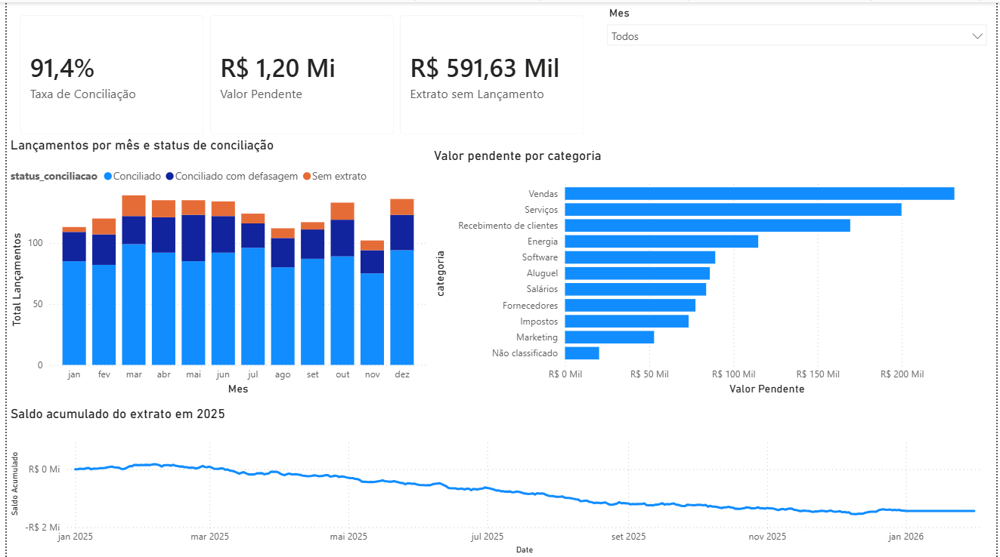

# Conciliação Bancária e Fluxo de Caixa

Simulação da rotina de conciliação entre o **extrato bancário** e os **lançamentos do financeiro** de uma empresa, com identificação de pendências, duplicidades e divergências de valor. Ferramentas: **Python (Pandas), PostgreSQL e Power BI (DAX)**.



## Contexto

Em rotinas de BPO financeiro, conciliar o que o banco registrou com o que a empresa lançou é o que garante um saldo confiável. Este projeto reproduz essa rotina de ponta a ponta: gera os dados, trata, concilia por regra em SQL e apresenta os resultados em um dashboard.

**Nota sobre os dados:** todos os dados são **sintéticos**, gerados em Python. Foram inseridas divergências propositais (lançamentos que não chegam ao banco, valores descontados, linhas duplicadas e tarifas não lançadas) para que houvesse o que investigar.

## Regra de conciliação

Um lançamento é considerado conciliado quando existe uma linha do extrato com:

- **valor igual**;
- **tipo compatível** (Receita com Crédito, Despesa com Débito);
- **data do extrato entre 0 e 3 dias depois** da data do lançamento.

Cada lançamento fica com um único par (o mais próximo em data), usando `ROW_NUMBER()`.

## Principais resultados

| Indicador | Resultado |
|---|---|
| Lançamentos analisados | 1.500 |
| Taxa de conciliação | **91,4%** (1.371 lançamentos) |
| Conciliados no mesmo dia | 1.056 |
| Conciliados com defasagem (1 a 3 dias) | 315 |
| Lançamentos sem extrato | 129, somando **R$ 1.198.039,89** |
| Linhas do extrato sem lançamento | 78, somando **R$ 591.632,47** |

## Insights

- **Vendas concentra a maior pendência:** 26 lançamentos e R$ 231.169,49 sem correspondência no extrato. Recomendo revisar a rotina de baixa de recebimentos dessa categoria.
- **Março é o mês mais crítico**, com 17 lançamentos pendentes (R$ 157.822,43).
- **Nem toda pendência é dinheiro perdido:** 52 lançamentos sem extrato têm um par no extrato com valor até R$ 50 menor, da mesma contraparte, somando R$ 1.472,89 de diferença. Indica tarifa ou desconto na chegada. Os demais (cerca de 77) não têm nenhum correspondente e precisam de investigação.
- **12 tarifas de manutenção (R$ 89,90 cada)** aparecem no extrato e nunca foram lançadas no financeiro. Sugiro criar um lançamento recorrente.
- **15 linhas duplicadas no extrato** devem ser confirmadas com o banco antes do fechamento. Elas foram sinalizadas, não apagadas, porque duas linhas iguais podem ser pagamentos legítimos.
- O saldo acumulado termina o período negativo, o que é uma característica da base fictícia (55% dos lançamentos são despesas), e não um resultado real.

## Estrutura do projeto

```
├── data/                 bases brutas e tratadas (CSV)
├── notebooks/
│   ├── 01_gerar_dados.py             gera os dados sintéticos
│   └── 02_limpeza_exploracao.ipynb   limpeza, exploração e carga no banco
├── sql/
│   ├── 01_criar_tabelas.sql
│   ├── 02_conciliacao.sql            regra de conciliação e views de status
│   └── 03_analises.sql               consultas de análise
├── powerbi/
│   ├── conciliacao_financeira.pbix
│   └── dashboard.png
└── README.md
```

## Etapas

1. **Python:** geração dos dados, diagnóstico de problemas (nulos, duplicados, texto inconsistente) e tratamento, com as decisões documentadas no notebook.
2. **SQL (PostgreSQL):** criação das tabelas, conciliação com `JOIN`, `CASE WHEN` e `ROW_NUMBER()`, views de status e consultas de análise (CTEs, `FILTER` e window functions para o saldo acumulado).
3. **Power BI:** modelo com tabela Calendário, medidas em DAX e dashboard com indicadores, evolução mensal, pendências por categoria e saldo acumulado.

## Medidas DAX

```
Total Lançamentos = COUNTROWS(LancStatus)
Conciliados = CALCULATE([Total Lançamentos], LancStatus[status_conciliacao] <> "Sem extrato")
Taxa de Conciliação = DIVIDE([Conciliados], [Total Lançamentos])
Valor Pendente = CALCULATE(SUM(LancStatus[valor]), LancStatus[status_conciliacao] = "Sem extrato")
Extrato sem Lançamento = CALCULATE(SUM(ExtStatus[valor]), ExtStatus[status_conciliacao] = "Sem lançamento")
Fluxo de Caixa = SUMX(ExtStatus, IF(ExtStatus[tipo] = "Crédito", ExtStatus[valor], -ExtStatus[valor]))
Saldo Acumulado = CALCULATE([Fluxo de Caixa], FILTER(ALL(Calendario[Date]), Calendario[Date] <= MAX(Calendario[Date])))
```

## Limitações

- A regra só concilia **valores exatos**. Pagamentos parcelados, agrupados ou em lote exigiriam outra lógica.
- A tolerância de 3 dias é fixa. Em uma operação real ela varia por meio de pagamento (PIX, boleto, cartão).
- Os pares de divergência de valor foram identificados por consulta, mas não entram na taxa de conciliação.

## Como reproduzir

1. Instalar Python, PostgreSQL e Power BI Desktop.
2. `python -m pip install pandas numpy faker sqlalchemy "psycopg[binary]"`
3. Rodar `notebooks/01_gerar_dados.py` na raiz do projeto.
4. Rodar o notebook `02_limpeza_exploracao.ipynb`, que carrega os dados no banco `Portfolio`.
5. Executar `sql/02_conciliacao.sql` e depois `sql/03_analises.sql` no pgAdmin.
6. Abrir `powerbi/conciliacao_financeira.pbix` e atualizar os dados.

---

Autora: [seu nome] · LinkedIn: [seu link]